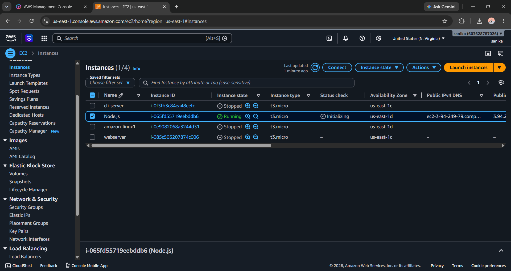
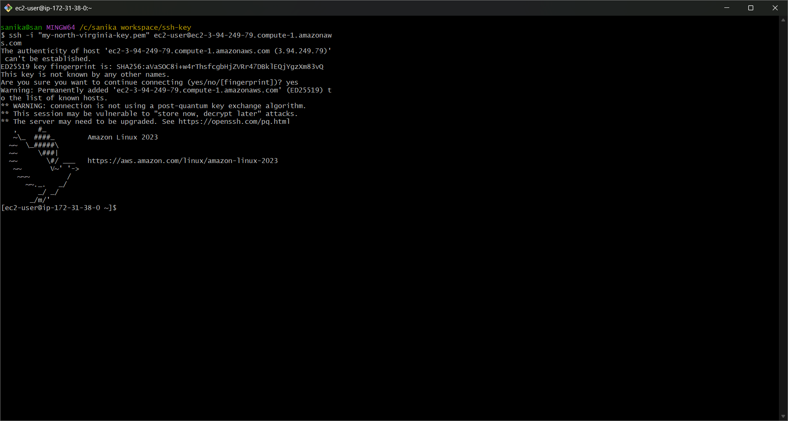
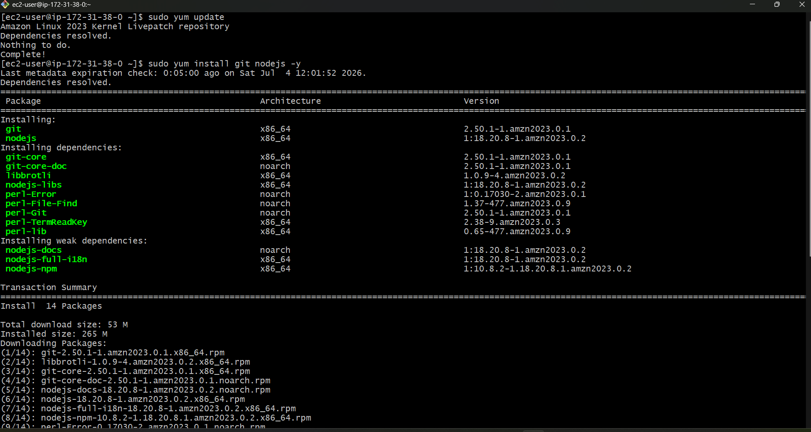
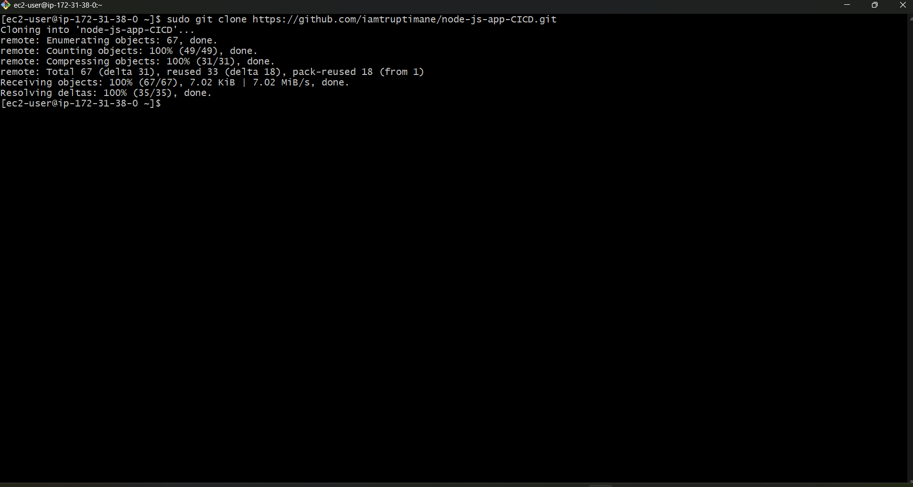
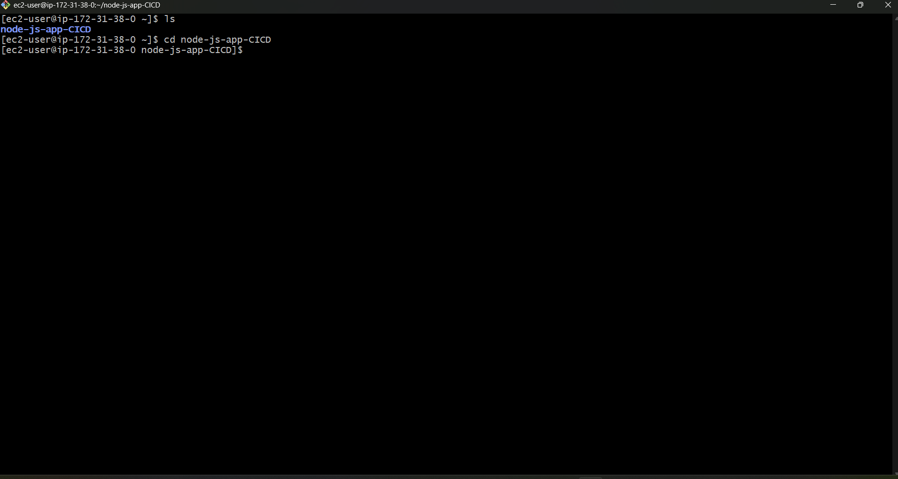
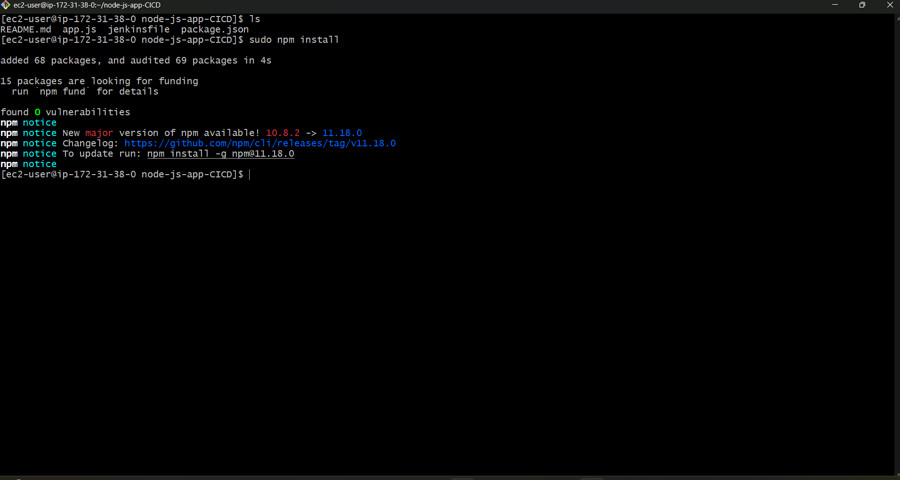
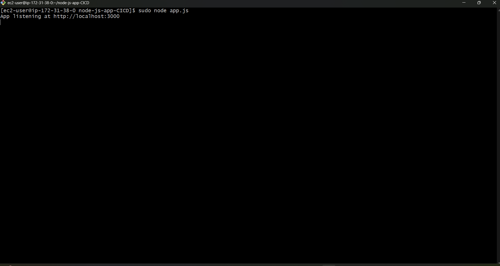
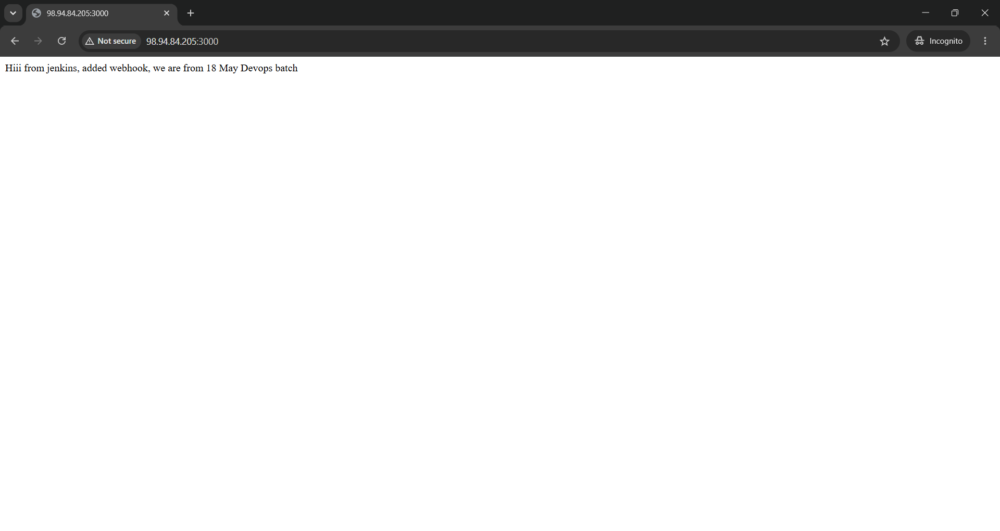

# Node.js Application Deployment on Amazon Linux (EC2)

### Introduction
This is my another project where I deployed a Node.application on an Amazon Linux EC2 server. In this
project, I learned how Node.js works as its own server, so no external web server like NGINX or Apache is
required. The application files (app.js and package.json) were provided by my mentor through a GitHub URL,
and I deployed the project by cloning and running it on the server
#
### Architecture Overview

#
### Technologies Used
* Amazon Linux (EC2)
* Node.js
* NPM (Node Package Manager)
* Git
### Features
* Node.js runs its own server
* No need for NGINX or Apache
* Application runs using node app.js
* Accessible via EC2 public IP and port
## Setup & Deployment Steps
### 1.Launch EC2 instance
1.1 Create Amazon linux EC2 instance

1.2 Connect using SSH

### 2.Install Git

sudo yum update  
sudo yum install git -y

### 3.Clone Project from Github

git clone

### 4.Go Inside Project Folder

cd nodejs.app

### 5. Dependencies

5.1 Install Dependencies

npm install

5.2 Ensure that all required dependencies are installed before running the project

cd node_modules

### 6.Run Application

node app.js

### 7.Access Application
* open browser  
* Enter-> your-ec2-public-ip:port 
* Application Will be Live

### What I Learned
* Basics of Node.js 
* Running server using Node.js 
* Using npm to install dependencies
* Deploying application on EC2  
* Difference between Node.js and NGINX/Apache

### Future Improvements
* Use PM2 to keep app running 
* Add domain name 
* Enable HTTPS 
* Deploy using Docker 

### Summery

This project helped me understand how Node.js works as a server and how to deploy applications without using traditional web servers. It is an important step in learning backend development, DevOps, and cloud deployment.

